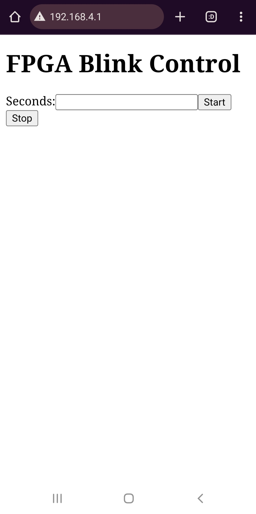

<h1 align = "center"> WebBlink </h1>

# An extension of the LED Blink Example for LilyGO T-FPGA
## Description
The onboard ESP32S3 creates a wepbage where a user can enter the number of seconds to blink Bank2 **IOR15A** which can power an LED.
The webserver runs on one core of the ESP32 with a heartbeat signal that flashes onboard LED **GPIO46**, while the other core communicates with SPI to the FPGA. The FPGA gets the time to blink, then starts a timer, which ends when the timer expires or it gets sent a stop command. The FPGA sends back the remaining time over SPI to the ESP32 which prints it out in the serial monitor so the user can see what the FPGA is doing. This example can be extended to other simple tasks to utilize both chips onboard the LilyGO T-FPGA. Notably the hard core CPU in the FPGA is still under utilized.
This code was extended from the LilyGO spi-blink example which does not work properly.

## Quick Start
Follow the Arduino directions at the start of the README.md at this repo to upload the code from this repository: https://github.com/Xinyuan-LilyGO/T-FPGA/tree/main

- Connect to both USB-C ports from your computer. 
- Upload the ESP32 code first so it can set the bank voltages for the FPGA.
    - The ESP32 project can be uploaded from Arduino IDE easily.
- Then launch the GOWIN App and open the FPGA project.
- Run Synthesis (spinning arrow icon)
- Make sure there is no errors, then upload the bitstream to the FPGA using the Gowin Programmer app which can be launched with the Programmer icon from the main App. (arrow with some bits next to it).
- Make sure the cable connects in the programmer. If it doesn't, you may need to mess with USB drivers with Zadig which is briefly discussed on the main LilyGO repo. 
- Upload the FPGA code

To see the FPGA's LED blinking:
Make sure to put an LED into Bank2 that is protected by a resistor. **IOR15A** will have around 2.442 volts, 8mA.

The webpage is accessible via these credentials:
```
WiFi SSID: FPGA-Blink
```
Then open a browser and go to ***192.168.4.1***

You should see this page load:




Update: Xiang Jin has created two additional examples, pwm_generator and led_blink, that I have tested. The led_blink example may need the esp32 to be unplugged and power cycled for the onboard LED to start shining. Something with the power bank activation with the PMU. Will try to solve later. pwm_generator can control a servo or something else depending on if the onboard button is held. 
